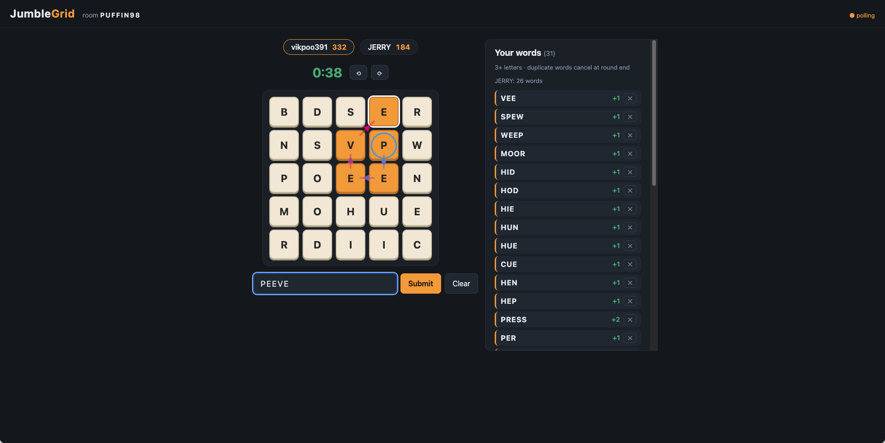

# JumbleGrid

Self-hosted online Boggle game. Zero dependencies — just Node.js.



## Run it

```bash
node server.js
```

Then open http://localhost:3000.

## Play with a friend over the internet

In a second terminal:

```bash
cloudflared tunnel --url http://localhost:3000
```

Send your friend the `https://….trycloudflare.com` URL it prints, plus your room
code. You both join the same room code and play on the same board.

## How it plays

- **Join** with a name and a shared room code.
- Pick **4×4** (classic dice) or **5×5** (Big Boggle dice) and hit **Start round**.
- 3-minute rounds. Build words by **dragging across adjacent tiles** (drag back
  one tile to undo, or tap the last tile again), tapping one at a time, or just
  **typing** — the grid live-highlights every chain matching what you've typed,
  narrowing as you go; if no chain exists the input flashes red (your text is kept).
- The ⟲ / ⟳ buttons **vote to rotate the board**; when every player votes for
  the same direction, the board rotates for everyone. Click again to withdraw.
- Two modes (picked when starting a round): **📖 dictionary** rejects fake
  words instantly; **🚩 challenge** accepts anything traceable on the grid —
  after the reveal, flag fishy words and everyone votes ✓ real / ✗ fake.
  Majority removes it (scores recompute), tie goes to the **host** (★, the
  first player who joined), and a word that survives is 🛡 shielded from
  re-challenge.
- During the round you see only **your own** word list (plus your opponent's
  word *count*). At round end everyone's list is revealed side by side —
  unique words with their points, duplicates struck through with who else had
  them. Any word claimed by two or more players is **cancelled**, and each
  player's remaining *unpaired* words are tallied — **most unpaired words wins
  the round**, with points (3–4 letters = 1, 5 = 2, 6 = 3, 7 = 5, 8+ = 11)
  shown alongside.
- Minimum word length: 3 letters on both grid sizes. "Qu" counts as two letters.
- Points from unpaired words accumulate across rounds in the same room.

## Dictionary (optional)

Out of the box there's no dictionary — any word that can be traced on the grid
is accepted, and either player can hit **✕** next to a word to veto a fake
(points are taken back). For automatic checking, drop a word list next to
`server.js`:

```bash
curl -o words.txt https://raw.githubusercontent.com/dolph/dictionary/master/enable1.txt
```

Restart the server and invalid words will be rejected automatically.
